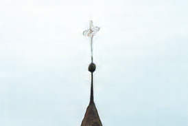

# Neural Image Compression with texture preservation and light-weight architecture design

## LS1906205 道尔格
### Master candidate

---

# Image compression

Image compression is an important task in computer science and engineering.

Two main approaches:
1. Lossy (estimating information). JPEG, MP4, MP3 etc.
2. Lossless (compressing information). For example, DEFLATE.

Discrete cosine transform (DCT), Huffman coding.

---

# Traditional approaches

Common **forward pipeline** consists of:

1. Forward transform.
2. Quantization.
3. Entropy coding.

Its corresponding **backward pipeline**:

1. Entropy decoding.
2. Inverse quantization.
3. Inverse transform

However this is not the only approach. Instead of using a predefined polynomial to encode an image, it is **possible to use neural networks** to pack and unpack information.

We highlight two **principles**:

1. Replacing parts of an old pipeline.
2. Building a new arch.

---
<!-- class: lead -->

# Neural image compression

- Use neural network to extract key features of given image
- These features take less space than original image
- Encode these features using already existing algorithms

Neural image compression is lossy, which means that compression leads to **information loss**. One of the aims while making a model for neural image compression is to minimize this information loss.

Application of neural image compression can be a new codec, that compresses image more efficiently.

---

# Existing methods

The most obvious approach is to use an autoencoder architecture: Encode image using one network and decode it back using decoder. Some authors complete it with custom quantization module based on attention <cite>[Learning Convolutional Networks for Content-weighted Image Compression]</cite>. Some authors use another autoencoder for further compression of features <cite>[High-Fidelity Generative Image Compression]</cite>.

*Autoencoder architecture*

---

# Research motivation

Traditional methods are simple both by architecture and computation. Neural network based methods are heavy, so we need to **reduce resource consumption**.

We also found that **false textures** sometimes pop up.

*An example of a false texture*

*Original texture*

---

# Framework

Our framework includes Encoder, Decoder (it includes upscale layers), Hyperprior module (we use it for feature compression).

*Our framework general pipeline*

---

# Encoder decoder architecture

*Encoder convolutional block*

*Decoder convolutional block*

---

# Fully convolutional networks

Fully convolutional network is being used both in encoder and decoder. FCN is a type of neural network, which doesn't have any pooling or interpolation layers. This helps to reduce information loss.

In upscale network we are using deconvolution operator, which is a reversed version of a normal convolution.

---

# Losses

Generator and compression model loss:

$
\mathcal{L}_{EGP}=E_{x\sim p_X}[\lambda r(y)+d(x, x')-\beta log(D(x',y))]
$

Discriminator loss:

$
\mathcal{L}_D=E_{y\sim p_Y}[-log(1-D(G(y,s),s))]+E_{x\sim p_X|s}[-log(D(x,s))]
$

---

# Training

*compression rate loss, Ox axis num iterations*

*distortion loss, Ox axis num iterations*

*rate/distortion loss, Ox axis num iterations*

---
<!-- class: invert -->

# Results

*Example of pure autoencoder model (right), original image (left)*

---
<!-- class: invert -->

# Results

*Example of blurry artifacts with hyperprior module with autoencoder*

---
<!-- class: invert -->

# Results

*Original (left), baseline (middle), improved (right)*

---
<!-- class: lead -->

# Future work

Future work mainly includes improving of generator part.

1. It is highly possible to reduce the number of layers in generator. 
2. Also, it is possible to change the structure of upper layers to resolve false textures issue.

---

# Schedule

Task | Description | Deadline | Status
-----|-------------|----------|-------
Research proposal 1 | Reduce number of layers in generator | February 1 | In progress
Research proposal 2 | Solve false textures issue | March 1 | In progress
Write the final thesis | Summarize research in the final thesis | May 20 | In progress